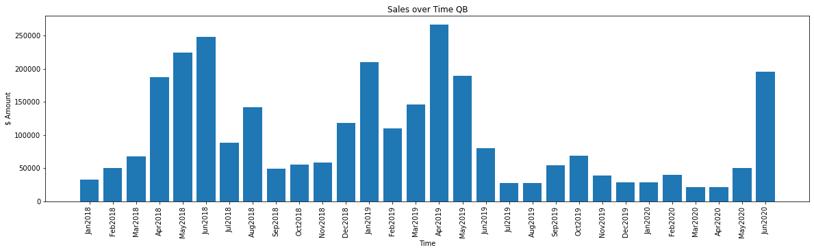
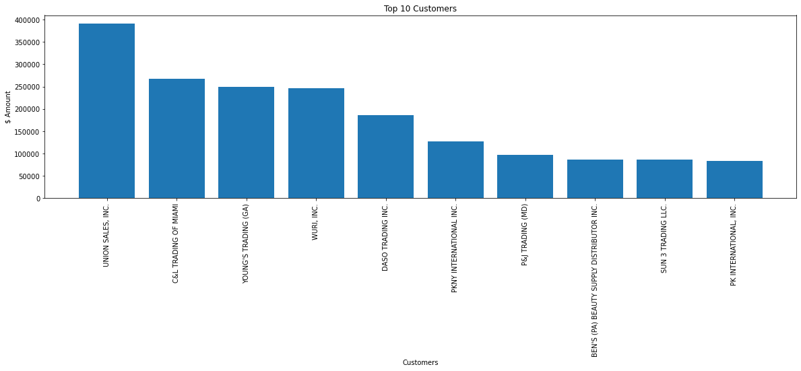
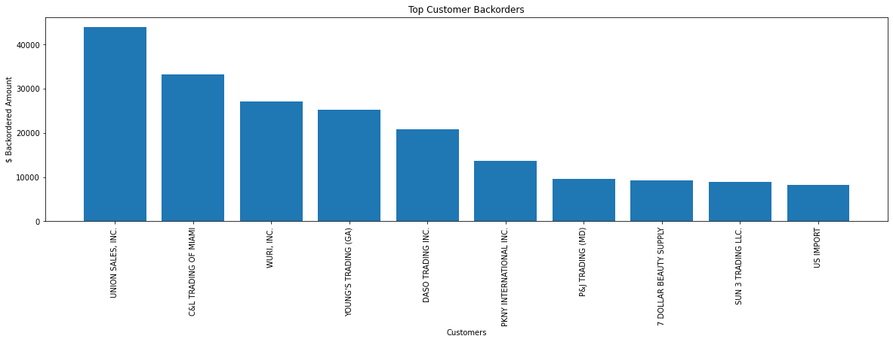
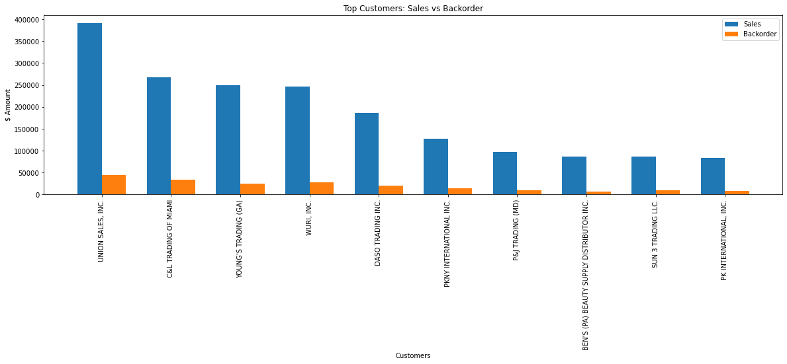

# M&M Headgear Analysis
Link to [M&M Headgear's online store](https://www.qfitt.com/).

This repo contains all code involving transforming M&M Headgear's Data into readable information. The data was extracted from Quickbooks; however, the data seems to be incomplete and missing multiple sales. Nonetheless, the data was used to answer any questions that might be found useful to the company:
- What is the sales over time like?
- Who are our top customers?
- Which customers have backorders?
- How do the top customers' sales compare to their backorders?
- What are our top 10 items?

## Part 1: Cleaning the data
The csv file needs to be cleaned as it contains null rows, null values, unlabeled sales, etc.


Let's first rename the unnamed column and remove the first index row.
```
df.rename(columns={'Unnamed: 0':'Inventory'},inplace=True)
df.drop([0],inplace=True)
```

The data also includes unnecessary data rows that contain information about freight, discounts, etc. Let's remove those rows of data. list_drop is a np array that contains all index values that are unncessary from our data.
```
inventory_df = df.drop(list_drop)
```

Next, we want to fill all of the empty "Inventory" values that are supposed to be equal to the inventory item above them. We create a for loop to fill in the empty value with the inventory item most recent item.
```
j=-1
for i in range(len(full_inventory_list)):
    if full_inventory_list[i] == 0:
        full_inventory_list[i] = inventory_list[j]
    else:
        j += 1
```
Lastly, we can drop the remaining null rows as they do not contain any information needed.
```
inventory_df.dropna(subset=['Type'],inplace=True)
```

## Part 2: Chart and Analysis
*Sales over Time*
The sales seem to be highest during the summer months. As a beauty supply company that focuses on wig-making, M&M Headgear might find this to be a result of the customers' increased interests during the summer as people tend to go outside more and go on vacations. Whereas during the winter season, customers would care to stay in homes more.


*Top 10 Customer Sales*
A simple chart to see who the company's top customers are and visualize the difference. M&M Headgear may want to know who to show more customer care for.


*Top 10 Backordering Customers*
A simple chart to see who the company's top backordering customers are. M&M Headgear may want to minimize the amount of backorders from these customers.


*Comparison between Top Customer Sales and their Backorders*
This chart seeks to compare customer sales to their backorders. As the companies who makes more sales may make more backorders, we want to make sure this correlation exists and make sure a customer who doesn't make many orders doesn't have an unusual high amount of backorders.


*Top 10 Items*
M&M Headgear can see the top 10 items by sales. M&M Headgear may be able to find what about these items make them popular and how they can maximize revenue


## Post
Although the data isn't completely accurate, the top customer sales, backorders, and items are most likely to not change. The cleaning process of the data is very specific to the data imported and will be need to be adjusted for data that does not match the format of the data. M&M Headgear does not possess the necessary tools to create these analysis nor do they have a database. With the newly installed system, M&M Headgear hopes to have an easier and access and clearer understanding of its sales. 

## Technologies
- Python (Jupyter Notebook)
- Matplotlib
