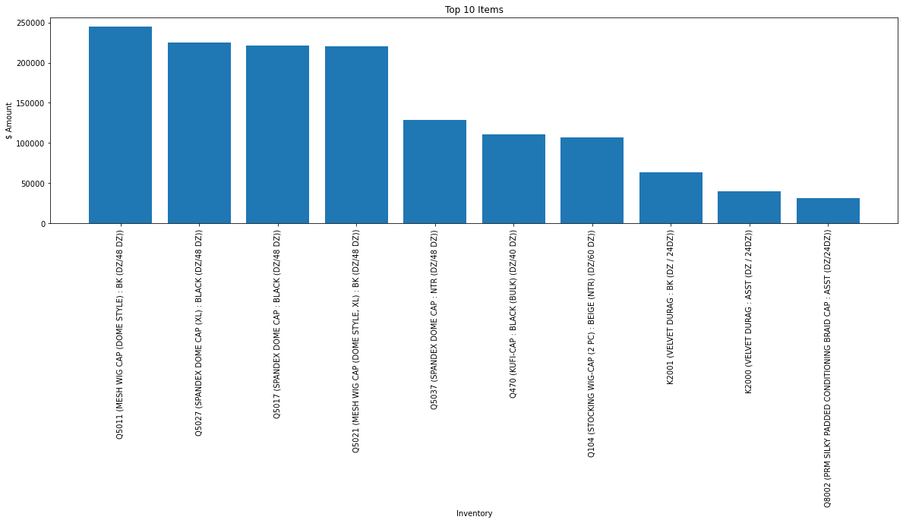

# M&M Headgear Analysis

This repo contains all code involving transforming M&M Headgear's Data into readable information. The data was extracted from Quickbooks; however, the data seems to be incomplete and missing multiple sales. Nonetheless, the data was used to answer any questions that might be found useful to the company:
- What is the sales over time like?
- Who are our top customers?
- Which customers have backorders?
- How do the top customers' sales compare to their backorders?
- What are our top 10 items?

## Part 1: Cleaning the data
The csv file needs to be cleaned as it contains null rows, null values, unlabeled sales, etc.


Let's first rename the unnamed column and remove the first index row.
```
df.rename(columns={'Unnamed: 0':'Inventory'},inplace=True)
df.drop([0],inplace=True)
```

The data also includes unnecessary data rows that contain information about freight, discounts, etc. Let's remove those rows of data. list_drop is a np array that contains all index values that are unncessary from our data.
```
inventory_df = df.drop(list_drop)
```

Next, we want to fill all of the empty "Inventory" values that are supposed to be equal to the inventory item above them. We create a for loop to fill in the empty value with the inventory item most recent item.
```
j=-1
for i in range(len(full_inventory_list)):
    if full_inventory_list[i] == 0:
        full_inventory_list[i] = inventory_list[j]
    else:
        j += 1
```
Lastly, we can drop the remaining null rows as they do not contain any information needed.
```
inventory_df.dropna(subset=['Type'],inplace=True)
```

## Part 2: Chart and Analysis
*Sales over Time*


*Top 10 Customer Sales*


*Top 10 Backordering Customers*


*Comparison between Top Customer Sales and their Backorders*


*Top 10 Items*


## Post

## Technologies
- Python (Jupyter Notebook)
- Matplotlib
